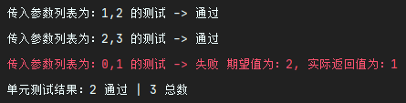
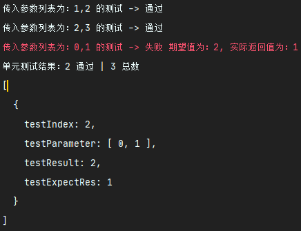

# JS Unit Test tool - `UnitTest`

If you want a lightweight `JavaScript` unit test plug-in.
Then use `UnitTest` directly to unit test your `JavaSript` code. Rest assured that `UnitTest` Core is only the size of `3KB`, so you don't have to worry about the impact of the introduction of `UnitTest` on the performance of your project.


The project follows the ESM specification, and the *UnitTest CMJ* project can be seen: 
 - GitHub: [UnitTest CMJ](https://github.com/KindllySatan/unit-test_cmj)
 - Gitee: [UnitTest CMJ](https://gitee.com/KindllySatan/unit-test-cmj)

## Install
```shell
npm install -d ks_unitTest_esm
```

## File directory

- `main.js` - Project entry file


## Usage

### 1. Import

```javascript
import { unitTestSet } from 'ks_unitTest_esm'


unitTestSet(fun, tsetList, resultList, debug);
```

### 2. Use `UnitTest`

To use `UnitTest` to help you implement unit tests, you need to provide something:

- `testFun`：The function you want to test
- `testList`：Test case parameter list
- `resultList`：List of test expected results
- `debug`：Whether to enable detailed error stack information of failed test cases. Default is false.

**Test Data**：

```javascript
// This is the test function.
const add = function (a, b) {
    return a + b;
}

// This is its list of test parameters, and it should be in the form of a two-dimensional array
//  [
//     [param1, param2 ...],		// Test case one
//     [param1, param2 ...],		// Test case two
//     [param1, param2 ...],		// Test case three
//  ]
const testList = [
    [1, 2],
    [2, 3],
    [0, 1]
];

// This is a list of its predictive trial results. 
// It should be in the form of an one-dimensional array. 
// The exact type of expected result depends on your own function return value format.
//  [
//     Expected to return result one,
//     Expected to return result two,
//     Expected to return result three
//  ]
const resultList = [
    3,
    5,
    2
];

const debug = false;

unitTestSet(add, testList, resultList, false);
```

**Sample output**：



### 3. Get information about failed unit test cases

Assuming that the given condition is the same as in `2. Use UnitTest`, you only need to name a variable to accept the return value of the `unitTestSet` function.

```javascript
const failTestList = unitTestSet(add, testList, resultList, false);
console.log(failTestList);
```

**Sample output**：




### 4. Self-test

Of course, a good unit test can test whether it is normal or not, and of course, because self-testing can lead to meaningless callbacks, the first `selfTestList.roomth` test results are the real unit test cases for self-testing.

**Test Data**：

```javascript
const testList = [
    [1, 2],
    [2, 3],
    [0, 1]
];

const resultList = [
    3,
    5,
    2
];

const selfTestList = [
    [unitTest, testList, resultList, false]
]

const selfResultList = [
    undefined
]

console.log('\n开始自我测试：');
unitTestSet(unitTestSet, selfTestList, selfResultList, false);
```

**Sample output**：


